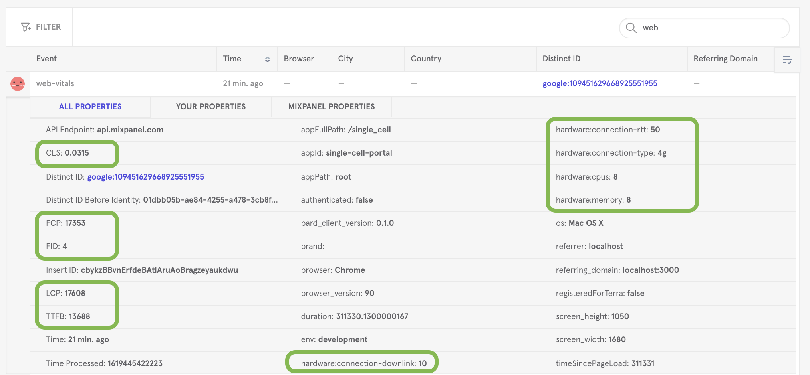

# Observability

Single Cell Portal has several tools for analyzing the web application and related software at various levels.

## Summary

| Store      | Non-production? | Production  | Covers |
| -----------|-----------------| ----------- | ------ |
| Mixpanel   | [Yes](https://mixpanel.com/project/2085496/view/19055/app/dashboards) | [Yes](https://mixpanel.com/project/2120588/view/19059/app/dashboards) | JS, Rails, Ingest
| Sentry     | No | [Yes](https://sentry.io/organizations/broad-institute/issues/?project=1424198) | Rails, Ingest
| Kibana     | No |   [Yes](https://dashboard.logit.io/a/a2d8b721-3ba5-4622-8843-ca48d7bf6e48) | Rails
| Rails VM   | No dev, [yes staging](https://console.cloud.google.com/compute/instancesMonitoringDetail/zones/us-central1-a/instances/singlecell-01?project=broad-singlecellportal-staging&tab=monitoring) | [Yes](https://console.cloud.google.com/compute/instancesMonitoringDetail/zones/us-central1-a/instances/singlecell-01?project=broad-singlecellportal&tab=monitoring) | App VM
| MongoDB VM | No dev, [yes staging](https://console.cloud.google.com/compute/instancesMonitoringDetail/zones/us-central1-a/instances/singlecell-mongo-02?project=broad-singlecellportal-staging&tab=monitoring) | [Yes](https://console.cloud.google.com/compute/instancesMonitoringDetail/zones/us-central1-a/instances/singlecell-mongo-01?project=broad-singlecellportal&tab=monitoring) | Database VM
| Local logs | Yes | Yes | Rails, Ingest

Note:
* JS: frontend JavaScript
* Rails: Ruby on Rails server application code
* Ingest: [Ingest Pipeline](https://github.com/broadinstitute/scp-ingest-pipeline), a Python ETL pipeline for user-generated single cell data

### Mixpanel

Mixpanel ([prod](https://mixpanel.com/project/2120588/view/19059/app/dashboards), [non-prod](https://mixpanel.com/project/2085496/view/19055/app/dashboards)) provides customizable charts for events in SCP and Terra.

### Sentry
[Sentry](https://sentry.io/organizations/broad-institute/issues/?project=1424198) tracks errors thrown by Ruby in the Rails app and Python in Ingest Pipeline.

### Kibana
[Kibana / Logit](https://dashboard.logit.io/a/a2d8b721-3ba5-4622-8843-ca48d7bf6e48) tracks granular, low-level Rails events logged on GCP VMs.

### Rails and MongoDB VMs
Google Cloud Platform (GCP) provides monitoring charts for CPU, memory, disk, and network utilization on the VM hardware that runs the Rails app server and MongoDB database.

### Local logs
Local logs exist on your SCP instance under `single_cell_portal_core/log/development.log` (or `.../staging.log` or `.../production.log`) for those environments.

## Performance
Speed is an important feature.  SCP closely tracks how long it takes to view a page, visualize data, and do other user actions.

### Web vitals and client hardware
Good [web vitals](https://web.dev/vitals/) improve user experience and findability via external search engines. They are measured for all page views.  [SCP tracks web vitals](https://mixpanel.com/s/1NHuvg):

* TTFB: time to first byte, the earliest page load event
* FCP: first contentful paint, when users gets first visual feedback
* LCP: largest contentful paint, a core measure of perceived load time
* FID: first input delay, when user can first interact (e.g. click)
* CLS: cumulative layout shift, measures visual stability

LCP, FID, and CLS are core web vitals. TTFB and FCP are useful supplements.

### Client hardware
Users' machines and connection speeds impact performance, so [SCP tracks client hardware](https://mixpanel.com/project/2120588/view/19059/app/dashboards#id=1037816):

* Memory (GB RAM)
* CPU (# CPUs)
* Internet connection:
  * Type: effective connection type, e.g. "4g"
  * RTT: round trip time, i.e. latency / ping (ms)
  * Downlink: download bandwidth in megabits per second (Mbps)

These metrics are tracked for all page views, and all logged events that involve an SCP API call.

Below is a screenshot of [event tracking page load performance](https://mixpanel.com/s/1pXBMo), highlighting metrics for web vitals metrics and client hardware.

### Plots
Fast visualizations help users explore hypotheses.  To know how best to optimize, we must first identify performance bottlenecks.  To know our changes resolve those bottlenecks, we must track them.

So SCP tracks plot performance in hierarchical segments.  The sum of `perfTime` values for all child segments matches the sum of `perfTime` in the parent segment.  This diagrams illustrates the concept for a hypothetical `scatter:plot` event.

For reference, below are the `perfTime` segments logged to Mixpanel, and related data transfer properties.

#### Total time
* _Full_: API call start to plot render end
* _Legacy_: API call start to end time plus plot time.  Inadequate because it excludes some client timing segments ("parse" and "other"; see below), and assumes the logged event is a plot.  This is a [forward-compatible](https://en.wikipedia.org/wiki/Forward_compatibility) name for old `perfTime` values, if/when they are replaced with preferable `perfTime:full` values.
* _`perfTime`_: Currently same as `perfTime:legacy`, for continuity.  Enables historical analysis without patching analytics queries in Mixpanel.  Will be replaced with `perfTime:full` in Q3 2021.  (Diagram shows `perfTime:full` as `perfTime`.)

#### Server time
* _Backend_: Time for server to process request.  We plan to track more specific segments like `perfTime:backend:cache` via [Server Timing API](https://medium.com/bbc-design-engineering/server-timing-in-the-wild-bfb34816322e).

#### Client time
* _Frontend_: API call response start to plot render end
* _Frontend, transfer_: Response start to response end; time to download entire response from server to client
* _Frontend, plot_: Start to end of plot render call.  (Only logged for plots.)
* _Frontend, parse_: Start to end of call to parse response body (currently only JSON)
* _Frontend, other_: Time for otherwise-unaccounted for client processing segments

#### Data
* _Compressed size_: Encoded response body size
* _Uncompressed size_: Decoded response body size
* _Compression bytes diff_: Absolute amount compressed
* _Compression ratio_: Relative amount compressed

All time values are in milliseconds and all data values (except compression ratio) are in bytes.
