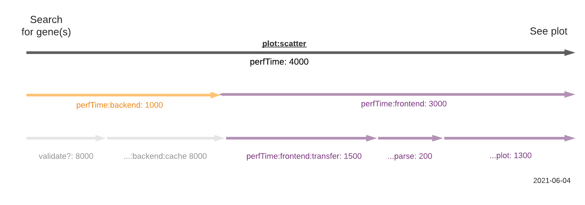

# Observability

Single Cell Portal has several tools for analyzing the web application and related software at various levels.

## Summary

| Store      | Non-production? | Production  | Covers |
| -----------|-----------------| ----------- | ------ |
| Mixpanel   | [Yes](https://mixpanel.com/project/2085496/view/19055/app/dashboards) | [Yes](https://mixpanel.com/project/2120588/view/19059/app/dashboards) | JS, Rails, Ingest
| Sentry     | No | [Yes](https://sentry.io/organizations/broad-institute/issues/?project=1424198) | Rails, Ingest
| Kibana     | No |   [Yes](https://dashboard.logit.io/a/a2d8b721-3ba5-4622-8843-ca48d7bf6e48) | Rails
| Local logs | Yes | Yes | Rails, Ingest

* JS: frontend JavaScript
* Rails: Ruby on Rails server application code
* Ingest: [Ingest Pipeline](https://github.com/broadinstitute/scp-ingest-pipeline), a Python ETL pipeline for user-generated single cell data

### Mixpanel

Mixpanel ([prod](https://mixpanel.com/project/2120588/view/19059/app/dashboards), [non-prod](https://mixpanel.com/project/2085496/view/19055/app/dashboards)) provides customizable charts for events in SCP and Terra.

### Sentry
[Sentry](https://sentry.io/organizations/broad-institute/issues/?project=1424198) tracks errors thrown by Ruby in the Rails app and Python in Ingest Pipeline.

### Kibana
[Kibana / Logit](https://dashboard.logit.io/a/a2d8b721-3ba5-4622-8843-ca48d7bf6e48) tracks granular, low-level Rails events logged on GCP VMs.

### Local logs
Local logs exist on your SCP instance under `single_cell_portal_core/log/development.log` (or `.../staging.log` or `.../production.log`) for those environments.

## Performance observability

### Web vitals and client hardware
Good [web vitals](https://web.dev/vitals/) improve user experience and findability via external search engines. They are measured for all page views.

[Tracked web vitals](https://mixpanel.com/s/1NHuvg):

* TTFB: time to first byte, the earliest page load event
* FCP: first contentful paint, when users gets first visual feedback
* LCP: largest contentful paint, a core measure of perceived load time
* FID: first input delay, when user can first interact (e.g. click)
* CLS: cumulative layout shift, measures visual stability

LCP, FID, and CLS are core web vitals. TTFB and FCP are useful supplements.

# Client hardware
Since users' machines and connection speeds impact performance, [SCP tracks client hardware](https://mixpanel.com/project/2120588/view/19059/app/dashboards#id=1037816):

* Memory (GB RAM)
* CPU (# CPUs)
* Internet connection:
  * Type: effective connection type, e.g. "4g"
  * RTT: round trip time, i.e. latency / ping (ms)
  * Downlink: download bandwidth in megabits per second (Mbps)

These metrics are tracked for all page views, and all logged events that involve an SCP API call.

### Plot performance

